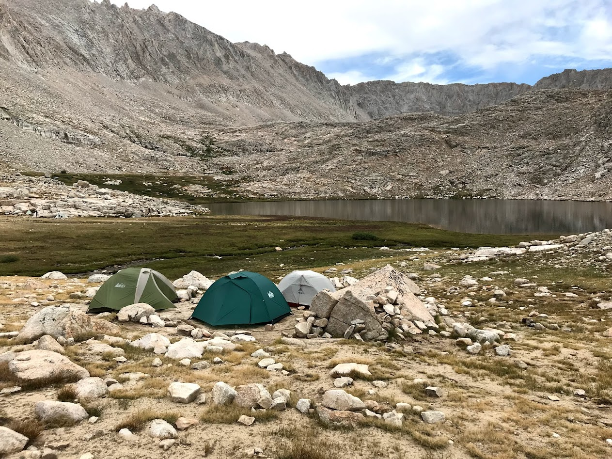

```{r setup, include=FALSE} 
knitr::opts_chunk$set( message = FALSE) 
```
# Who I am and where I came from

I grew up in San Jose, California, where I did not envision my future career as a researcher but instead as a veterinarian!. While attending undergrad at San Francisco State University I was lucky enough to join the disease ecology lab of [Dr. Andrea Swei](https://www.sweilab.com/) where I learned a ton about molecular ecology, the microbiome, and vector-pathogen-host interactions and changed my career goals. This experience led to me leading a field study looking for ticks in the Presidio of San Francisco, collaborating on a graduate student's research, and eventually my first publication [@kwan2017].

In addition to my research experience in San Francisco, I had the opportunity to work as a conservation intern at the San Francisco Zoo. There, I was able to raise and release Western pond turtles and Sierra Nevada yellow-legged frogs. It was an amazing experience to be able to practice some 'hands-on' conservation work. Check out this neat video of a yellow-legged frog release!

```{r, eval=T, echo=F}
library("vembedr")
embed<- embed_youtube("fVHl7zuJpfs")
use_align(embed, align = "center")
```

After working in research on disease ecology and conservation, I took a detour into human genomics. I was the lab manager and research scientist in the lab of [Dr. Dan Doherty](https://depts.washington.edu/joubert/) at University of Washington, where I did a lot of targeted and whole genome sequencing to look for variants that could cause Joubert syndrome and other hindbrain malformations. While I was there I collaborated with a lot of amazing researchers across the country and was able to publish a few new causes of Joubert including TOGARAM1 [@latour2020], TMEM218 [@vandeweghe2020], and SUFU haploinsufficiency [@serpieri2021], plus a neat new method to use CRISPR for fast, targeted capture [@mighell2020].

While human genomics was really interesting, I wanted to move back to thinking about conservation and molecular ecology. Currently, I am a Master's student in the [Ruegg lab](https://sites.google.com/rams.colostate.edu/ruegglab/home?authuser=0) at Colorado State University. I now work on understanding effects of climate change on the Canada warbler and how to use genomics to split a broad-ranging species into manageable units for conservation. If you aren't familiar with the Canada warbler, here is a very cute photo and an audio clip of their song!

```{r, eval=T, echo=F, fig.align='center'}
knitr::include_graphics("images/CAWA_adult_male_davidturgeon_June2016.jpg", auto_pdf = TRUE)
```

Interestingly, there is a knitting issue going from .RMD to .HTML that appears to be happening here. When I embed the audio in the .RMD, I get an embedded link to the footer of the audio file:

<center>

<iframe width="640" height="383" src="https://macaulaylibrary.org/asset/93792/embed/640" frameborder="0" allowfullscreen style="width:640px;">

</iframe>

</center>

But when I use a piece of dummy code and then insert the same embedding into the .HTML using an editor, I get the correct embedding here:

INSERT IFRAME HERE

Weird.

# Research Interests

Climate change, conservation, and genetics are my primary research interests. I'm interested in exploring how species change genetically as they adapt(or not) to climate change, then using this information to help guide species conservation efforts.

## Influential papers

One of the reasons I ended up at CSU was finding [@bay2018] which described an approach to use current genetic variation to predict population success at adapting to future climate changes. I was blown away! Here was an intersection of my research interests.

Another influential paper to how I approach climate and conservation is [@thurman2020]. Aside from the snappy title-'Persist in place or shift in space?'- it lays out the most basic responses that species can have to environmental change aside from extinction. Then the paper details a framework for assessing adaptive capacity that seems broadly relevant when thinking about conservation management.

## The mathematics behind my research

Where would we be without Hardy-Weinburg? $$f(A_1 A_1)=p^2, f(A_1 A_2)=2pq, f(A_2 A_2)=q^2$$ \
$$p^2+2pq+ q^2= 1$$

## My computing experience

My primary computing experience has included the basics of Java and Python, with a 'learned-on-the-job' bunch of shell scripting. And a bunch of using bioinformatics tools.

Here is a silly program from a course in Java that makes a cheating hangman program:

```{r, eval=F, echo=T}
// Class HangmanMain is the driver program for the Hangman program.  It reads a
// dictionary of words to be used during the game and then plays a game with
// the user.  This is a cheating version of hangman that delays picking a word
// to keep its options open.  You can change the setting for SHOW_COUNT to see
// how many options are still left on each turn.

import java.util.*;
import java.io.*;

public class HangmanMain  {
    public static final String DICTIONARY_FILE = "dictionary.txt";
    public static final boolean SHOW_COUNT = true;  // show # of choices left

    public static void main(String[] args) throws FileNotFoundException {
        System.out.println("Welcome to the cse143 hangman game.");
        System.out.println();

        // open the dictionary file and read dictionary into an ArrayList
        Scanner input = new Scanner(new File(DICTIONARY_FILE));
        List<String> dictionary = new ArrayList<String>();
        while (input.hasNext())
            dictionary.add(input.next().toLowerCase());

        // set basic parameters
        Scanner console = new Scanner(System.in);
        System.out.print("What length word do you want to use? ");
        int length = console.nextInt();
        System.out.print("How many wrong answers allowed? ");
        int max = console.nextInt();
        System.out.println();

        // set up the HangmanManager and start the game
        List<String> dictionary2 = Collections.unmodifiableList(dictionary);
        HangmanManager hangman = new HangmanManager2(dictionary2, length, max);
        if (hangman.words().isEmpty()) {
            System.out.println("No words of that length in the dictionary.");
        } else {
            playGame(console, hangman);
            showResults(hangman);
        }
    }

    // Plays one game with the user
    public static void playGame(Scanner console, HangmanManager hangman) {
        while (hangman.guessesLeft() > 0 && hangman.pattern().contains("-")) {
            System.out.println("guesses : " + hangman.guessesLeft());
            if (SHOW_COUNT) {
                System.out.println("words   : " + hangman.words().size());
            }
            System.out.println("guessed : " + hangman.guesses());
            System.out.println("current : " + hangman.pattern());
            System.out.print("Your guess? ");
            char ch = console.next().toLowerCase().charAt(0);
            if (hangman.guesses().contains(ch)) {
                System.out.println("You already guessed that");
            } else {
                int count = hangman.record(ch);
                if (count == 0) {
                    System.out.println("Sorry, there are no " + ch + "'s");
                    hangman.words();
                } else if (count == 1) {
                    System.out.println("Yes, there is one " + ch);
                    hangman.words();
                } else {
                    System.out.println("Yes, there are " + count + " " + ch +
                                       "'s");
                }
            }
            System.out.println();
        }
    }

    // reports the results of the game, including showing the answer
    public static void showResults(HangmanManager hangman) {
        // if the game is over, the answer is the first word in the list
        // of words, so we use an iterator to get it
        String answer = hangman.words().iterator().next();
        System.out.println("answer = " + answer);
        if (hangman.guessesLeft() > 0) {
            System.out.println("You beat me");
        } else {
            System.out.println("Sorry, you lose");
        }
    }
}
```

## What I hope to get out of this class

-   Learn how to keep code and figures in easily reproducible bundles.
-   Get familiar with git for version control
-   Explore some bioinformatics tools I haven't used before- genome assembly perhaps?

## Evaluating some R code

Here are some really lovely plots I found from [Coding Club](https://ourcodingclub.github.io/tutorials/dataviz-beautification/#distributions)

```{r, eval=T, echo=T, fig.align="center"}
library(tidyverse)
library(ggthemes)  # for a mapping theme
library(viridis)  # for nice colours

# Data ----
# Load data - site coordinates and plant records from
# the Long Term Ecological Research Network
# https://lternet.edu and the Niwot Ridge site more specifically
niwot_plant_exp <- read.csv("data/niwot_plant_exp.csv")

# DISTRIBUTIONS ----
# Setting a custom ggplot2 function
# This function makes a pretty ggplot theme

theme_niwot <- function(){
  theme_bw() +
    theme(axis.text = element_text(size = 16), 
          axis.title = element_text(size = 18),
          axis.line.x = element_line(color="black"), 
          axis.line.y = element_line(color="black"),
          panel.border = element_blank(),
          panel.grid.major.x = element_blank(),                                          
          panel.grid.minor.x = element_blank(),
          panel.grid.minor.y = element_blank(),
          panel.grid.major.y = element_blank(),  
          plot.margin = unit(c(1, 1, 1, 1), units = , "cm"),
          plot.title = element_text(size = 18, vjust = 1, hjust = 0),
          legend.text = element_text(size = 12),          
          legend.title = element_blank(),                              
          legend.position = c(0.95, 0.15), 
          legend.key = element_blank(),
          legend.background = element_rect(color = "black", 
                                           fill = "transparent", 
                                           size = 2, linetype = "blank"))
}

niwot_richness <- niwot_plant_exp %>% group_by(plot_num, year) %>%
  mutate(richness = length(unique(USDA_Scientific_Name))) %>% ungroup()
# This code loads the function in the working environment
source("https://gist.githubusercontent.com/benmarwick/2a1bb0133ff568cbe28d/raw/fb53bd97121f7f9ce947837ef1a4c65a73bffb3f/geom_flat_violin.R")

distributions6 <- 
    ggplot(data = niwot_richness, 
           aes(x = reorder(fert, desc(richness)), y = richness, fill = fert)) +
    geom_flat_violin(position = position_nudge(x = 0.2, y = 0), alpha = 0.8) +
    geom_point(aes(y = richness, color = fert), 
               position = position_jitter(width = 0.15), size = 1, alpha = 0.1) +
    geom_boxplot(width = 0.2, outlier.shape = NA, alpha = 0.8) +
    labs(y = "\nSpecies richness", x = NULL) +
    guides(fill = "none", color = "none") +
    scale_y_continuous(limits = c(0, 30)) +
    scale_fill_manual(values = c("#5A4A6F", "#E47250",  "#EBB261", "#9D5A6C")) +
    scale_colour_manual(values = c("#5A4A6F", "#E47250",  "#EBB261", "#9D5A6C")) +
    coord_flip() +
    theme_niwot()

distributions6

```

# Outside of Lab

When I'm not in lab you may find me:

1.  Running
2.  Backpacking
3.  Baking
4.  Playing video games online with friends around the country

Here's me camped at Guitar Lake below Mt. Whitney during a backpacking trip this past summer.

```{r image_grobs, out.width = "50%", fig.align = "center", echo=FALSE}


```

# Citations

I cited myself, but I admit I'm in the 'et al.' portions in some of these
